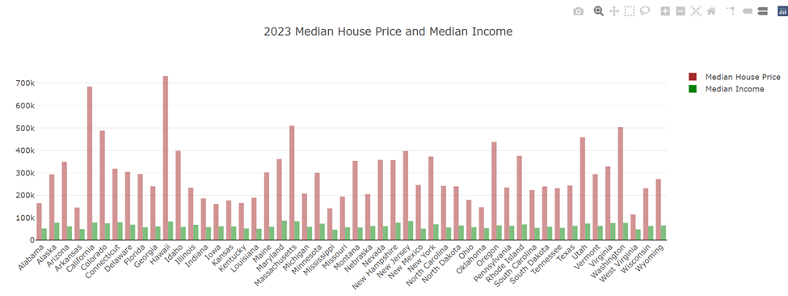
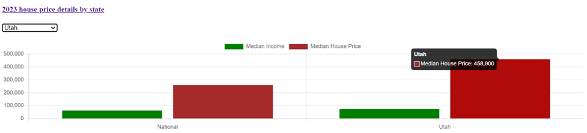
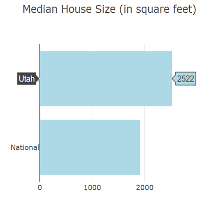
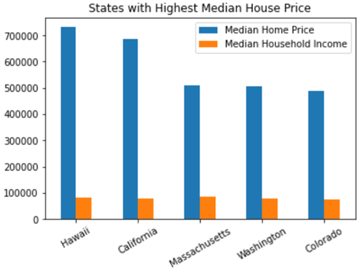
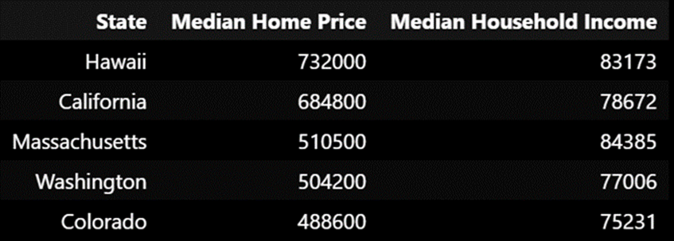
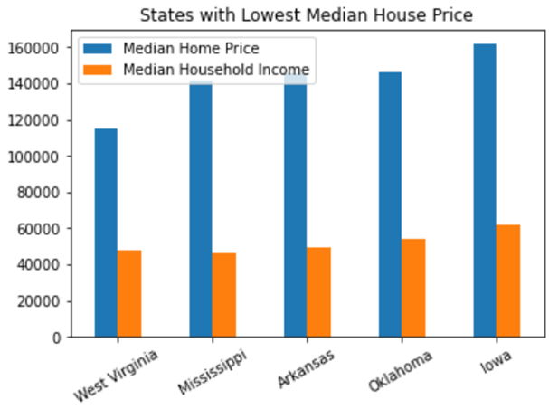
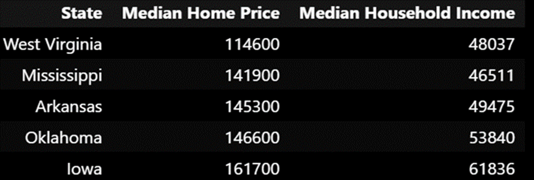
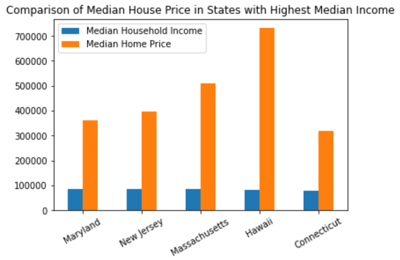

# House_Price_Analysis
Creating an interactive dashboard with visualizations of median house price details for each state.

### Analysis of Median House Price data across the 50 states in USA:

Input data is available in Resources\data\house_price_data.xlsx

- load_data.ipynb - In this Jupyter notebook, a sqlite database named "housing.sqlite" is created and the input data from excel file is loaded into "house_data" table in the sqlite database.

- app.py  - This Python file is executed to create the dashboard showing the house price details visualiasations. Reading the data from sqlite database and sending it to Flask API are handled in this python file.

- index.html - This HTML file is used to display the dashboard with different bar charts. It includes references to d3.js, Plotly.js, chart.js along with the reference to static.css file and script.js file.

- styles.css - This CSS file has few stying for the charts.

- script.js - This JavaScript file has the code for processing the data and generating the following 3 charts for the dashboard:

### Executing the application:

When the python fle is executed, it gives the localhost link as shown below: The link may vary in different machines.

        Running on http://127.0.0.1:5000

The localhost URL, takes to a page with the following 2 links:

* Overview of 2023 House Price
* 2023 House Price Details by State

### 2023 Median house price and median Income:

When "Overview of 2023 house price" link is clicked, the following chart will be displayed.

Hawaii tops the list at $732,000, followed by California at $684,800. West Viginia is at the bottom of the list with median house price at $114,600.

### Comparison of National medians with that of selected state:

When "2023 house price details by state" link is clicked, a dropdown with the list of states will be shown along with the following charts. Based on the selected state, the chart will be updated dynamically.

* The median house price in Utah is $458,900. The National median house price is $259,350. 

* The median household income in Utah is $74,197. The National median household income is $62,529. 

* The median house size in Utah is 2,522 square feet. The national median is 1,913.5 square feet.

### States with Highest and Lowest Median house price:

analysis.ipynb - This Jupyter notebook has the data analysis regarding the states with highest and lowest median house price and those with lowest and highest median income compared with the median house price.

   

The median house price in Hawaii and California is almost 9x the median household income. In Massachusetts,  Washington and Colorado, the median house price is around 6x the median income.

  

In West Virginia, Mississippi, Arkansas, Oklahoma and Iowa, the median house price is about 3x the median household income. 

### States with highest median income compared with the median house price:

Maryland has the highest median household Income. The Median Household Income in Maryland, New Jersey, Massachusetts and Hawaii is in a close range, however the Median house price in Maryland and New Jersey are about half the median house price in Hawaii.

Data source : Rocket Homes [https://www.rockethomes.com/blog/housing-market/median-home-price-by-state]